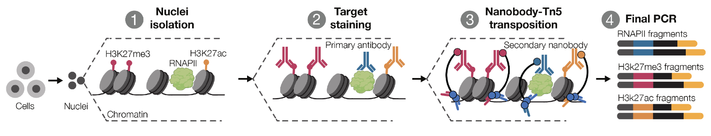

# <ins>N</ins>anobody-<ins>t</ins>ethered <ins>t</ins>agmentation followed by sequencing (NTT-seq)

This repository contains code needed to reproduce the analyses shown in
[Stuart et al. (2022), *bioRxiv*](https://doi.org/10.1101/2022.03.08.483436)

More information about NTT-seq can be found at the [NTT-seq website](https://ntt-seq.com)



## Installing dependencies

All the required dependencies needed to run the workflow can 
be installed automatically by creating a new conda environment.

First ensure that [conda](https://docs.conda.io/en/latest/miniconda.html)
or [mamba](https://github.com/mamba-org/mamba) is installed and available.

To create a new environment with the dependencies installed, run:

```
# using conda
conda env create -f environment.yaml
```

```
# using mamba
mamba env create -f environment.yaml
```

## Running the workflow

This workflow involves downloading data from AWS using the AWS
command line tools. To enable the download, you will first need
to create an AWS account and set up the AWS command line tools by
running `aws configure`. *Note that some of the data downloaded
may incur charges from AWS*.

To run the Snakemake workflow, first activate the conda environment
containing the required dependencies:

```
conda activate ntt
```

Next, run `snakemake` with the desired options. Setting the `-j` parameter
controls the maximum number of cores used by the workflow:

```
snakemake -j 24
```

See the [snakemake](https://snakemake.readthedocs.io/en/stable/)
documentation for a complete list of available options.

## Data availability

Processed datasets from this study are available from:

* GEO: [GSE212588](https://www.ncbi.nlm.nih.gov/geo/query/acc.cgi?acc=GSE212588)  
* SRA: [SRP395379](https://www.ncbi.nlm.nih.gov/sra/?term=SRP395379)  
* Zenodo: [7102159](https://zenodo.org/record/7102159)  
* dbGaP: []()  

## Plasmid availability

Plasmids generated from this study are available from [AddGene](https://www.addgene.org/):

* [pTXB1-nbOcIgG-Tn5](https://www.addgene.org/184285)  
* [pTXB1-nbMmKappa-Tn5](https://www.addgene.org/184286)  
* [pTBX1-nbMmIgG1-Tn5](https://www.addgene.org/184287)  
* [pTBX1-nbMmIgG2a-Tn5](https://www.addgene.org/184288)

## Citation

```
@UNPUBLISHED{Stuart2022,
  title    = "Nanobody-tethered transposition allows for multifactorial
              chromatin profiling at single-cell resolution",
  author   = "Stuart, Tim and Hao, Stephanie and Zhang, Bingjie and
              Mekerishvili, Levan and Landau, Dan and Maniatis, Silas and
              Satija, Rahul and Raimondi, Ivan",
  journal  = "bioRxiv",
  pages    = "2022.03.08.483436",
  month    =  mar,
  year     =  2022,
  url      = "https://www.biorxiv.org/content/10.1101/2022.03.08.483436v1",
  language = "en"
}
```
